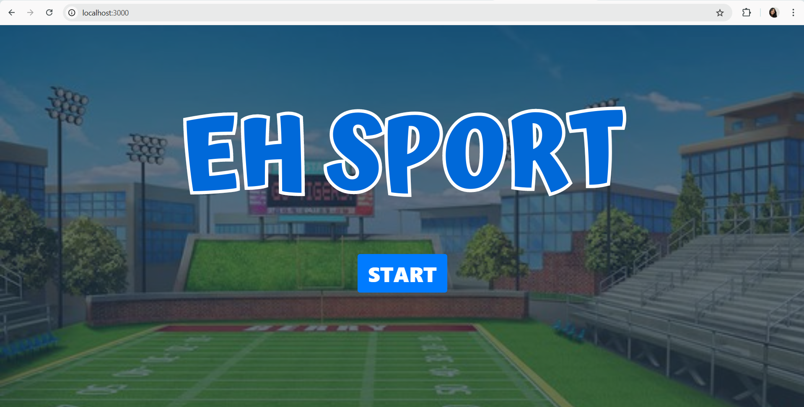
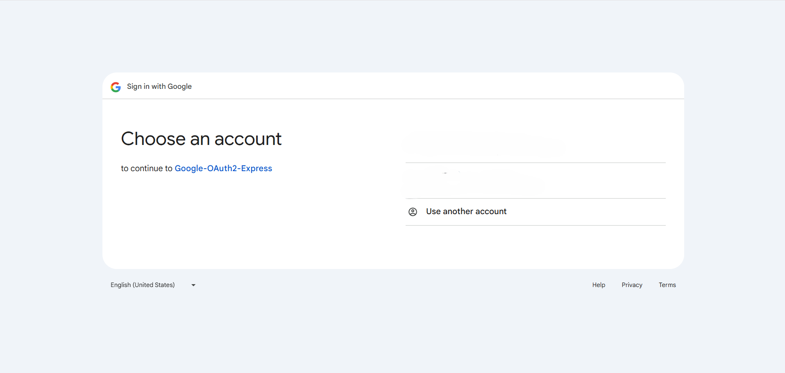

````markdown
# Eh Sport - Google OAuth2 Express

**Eh Sport** is a fun and interactive Express application that demonstrates how to integrate **Google OAuth2** authentication using the `passport-google-oauth2` strategy.

Once you log in with your Google account, you'll be able to see a character race, and the winner of the race is displayed on the home page. It's a quirky way to experience OAuth2 authentication!

## Prerequisites

Before running the application, ensure that you have the following:

- **Node.js** installed (v20.6.1 or above recommended).
- **npm** or **yarn** for managing dependencies.
- A **Google Developer Console project** with **OAuth2 credentials**.

## Setup Instructions

1. **Clone this repository**:
   ```bash
   git clone https://github.com/scientyxx/Google-Oauth2-Express.git
   cd Google-Oauth2-Express
   ```
````

2. **Install dependencies**:
   Run the following command to install the required packages:

   ```bash
   npm install
   ```

3. **Create OAuth2 Credentials**:

   - Go to the [Google Developer Console](https://console.developers.google.com/).
   - Create a new project or use an existing one.
   - Navigate to **APIs & Services** > **Credentials**.
   - Create OAuth 2.0 credentials by selecting **OAuth 2.0 Client IDs**.
   - Set the **Redirect URI** (callback URL) to `http://localhost:3000/auth/google/callback`.
   - Note down your **Client ID** and **Client Secret**.

4. **Configure the application**:
   Add your **Google Client ID** and **Client Secret**: at auth.js

   ```bash
   GOOGLE_CLIENT_ID=your-google-client-id
   GOOGLE_CLIENT_SECRET=your-google-client-secret
   ```

5. **Run the application**:
   After setting up the `auth.js` file, run the following command to start the application:

   ```bash
   npm start
   ```

6. **Test the application**:
   Open your browser and go to http://localhost:3000. You will see a 'Start' button. Once you click the button, a race with characters will begin. After a successful login, the race will continue, and you will see who the winner is

## Routes

- **`GET /`**: Displays the homepage with a "Login with Google" button and the race view where you can watch characters run.
- **`GET /auth/google`**: Redirects users to Google for authentication.
- **`GET /auth/google/callback`**: Google redirects back to this route after authentication, where user data is processed and stored.
- **`GET /profile`**: Displays the user's Google profile information and character race results once authenticated.

## Notes

- The redirect URI in Google Developer Console must match the callback URL used in the app (`http://localhost:3000/auth/google/callback`).
- To stop the application, press `Ctrl+C` in your terminal.

## Screenshot Application





